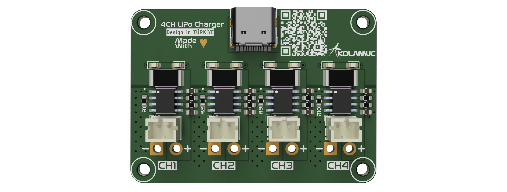
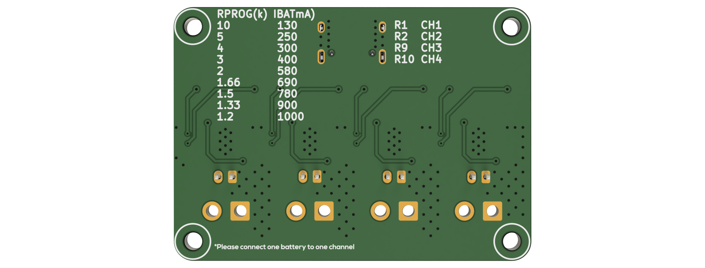

  <b>
   <h1>
      4CH USB LiPo Charger
   </h1>
   <h6>
     V1
   </h6>
  </b>
    
    

### What is this project?
* 4CH USB LiPo Charger is charges 4 lipo batteries simultaneously via USB.
* You can choose separate charging current for each channel.
* Max 1.2A Charge current for each channel.
* Charge and Done Leds for each channel.
* JST-PH.2 connector and molex jst cable connection.